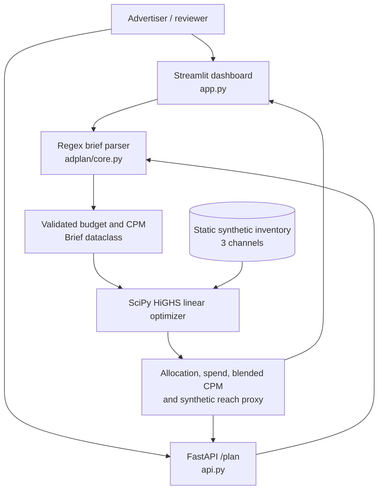
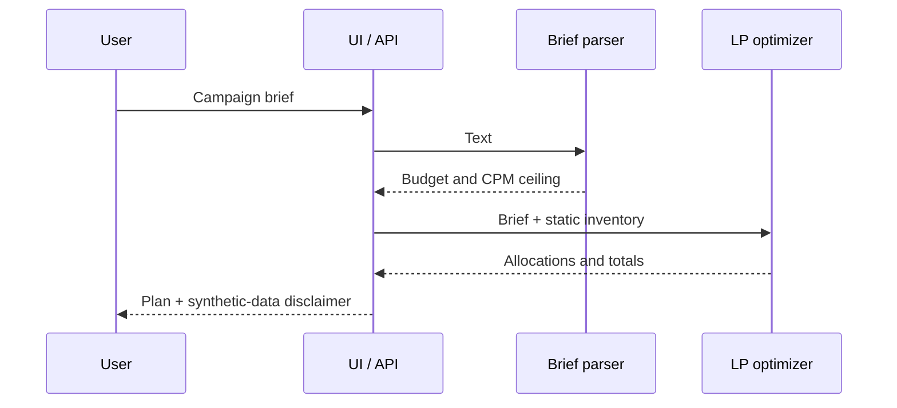
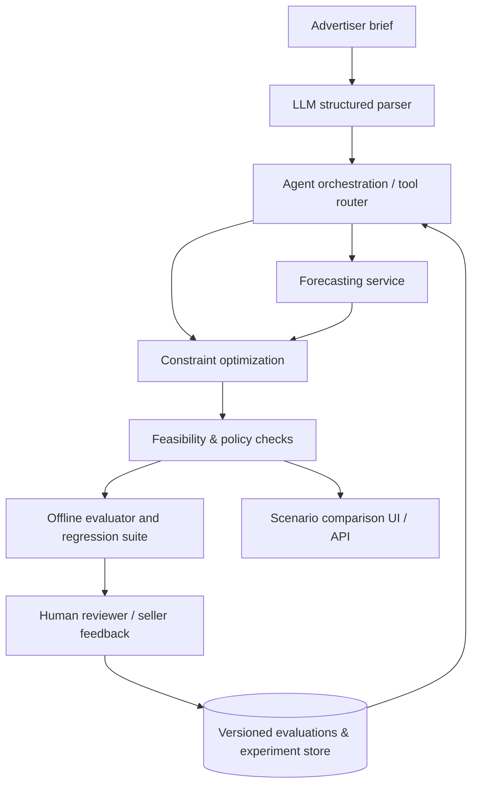

# AdPlan AI — System Architecture

**Version:** 0.1 · **Status:** implemented prototype + explicitly marked roadmap

> Independent synthetic-data portfolio project; not affiliated with Netflix. The current code does **not** contain a trained ML model or conversational LLM agent.

## 1. Current system context



### Implemented modules

| Component | File | Responsibility | State |
|---|---|---|---|
| Interactive UI | [app.py](../app.py) | Enter brief, show KPIs, allocation table and chart | Implemented |
| REST interface | [api.py](../api.py) | POST /plan, structured JSON output, validation error handling | Implemented |
| Brief parsing | [adplan/core.py](../adplan/core.py) | Extract dollar budget and limited CPM patterns | Implemented (regex, not LLM) |
| Inventory | [adplan/core.py](../adplan/core.py) | Three static channels, CPM, capacity and reach factors | Implemented (synthetic) |
| Optimizer | [adplan/core.py](../adplan/core.py) | Maximize reach proxy under spend, capacity and blended CPM constraints | Implemented |
| Automated checks | [tests/test_core.py](../tests/test_core.py) | Parser errors and optimization constraints | Implemented |
| Trained demand forecasting | — | Forecast outcomes with uncertainty | **Not implemented** |
| LLM conversational agent | — | Structured brief interpretation, tools and dialogue | **Not implemented** |
| Feedback-driven improvement | — | Capture seller corrections and monitor quality | **Not implemented** |
| Cloud deployment / CI | — | Continuous delivery and observability | **Not implemented** |

## 2. Optimization formulation

Let `x_i` be impressions allocated to channel `i`; `c_i` be cost per thousand impressions (CPM); `r_i` be a synthetic reach-factor coefficient; `q_i` be channel capacity; `B` be campaign budget; and `C` be maximum blended CPM.

**Objective:** maximize `sum_i r_i * x_i` (a synthetic reach proxy, **not** deduplicated reach).

**Constraints:**
- Budget: `sum_i (c_i/1000) * x_i <= B`
- Capacity: `0 <= x_i <= q_i`
- Blended CPM: `sum_i (c_i - C) * x_i <= 0` (algebraically equivalent when total impressions are positive)

The solver uses SciPy `linprog(method="highs")`. This is a continuous linear program, so its outputs can include fractional impressions before rounding for display. It is **not** a full media reach/frequency optimization, and the objective does not account for audience overlap or diminishing returns.

## 3. Request lifecycle



## 4. Future architecture (not yet built)



**Proposed, not implemented:** Pydantic structured LLM extraction; LangGraph orchestration; trained outcome models; scenario comparisons; agent tool-use evaluation; seller feedback and audit trails; MLflow tracking; Docker/CI/CD; production observability.

## 5. Interfaces and examples

### API request

```http
POST /plan
Content-Type: application/json

{"text": "We have $500,000 for an electric SUV campaign. Keep CPM below $25."}
```

The API returns a `brief` object, channel-level `allocation`, `total_spend`, `unspent_budget`, `blended_cpm`, `estimated_reach_proxy` and a disclaimer. Invalid briefs return HTTP 422.

### Local execution

```bash
pip install -r requirements.txt
streamlit run app.py
# Separate terminal:
uvicorn api:app --reload
pytest -q
```

## 6. Risks and engineering tradeoffs

- **Interpretation:** regex is inexpensive and deterministic but fails on many valid natural-language phrasings.
- **Reach:** linear synthetic factors do not estimate unique people or overlap between channels.
- **Feasibility:** the blended CPM cap is an aggregate constraint; an individual channel may exceed the cap if other channels offset it.
- **Rounding:** reported values are rounded; use solver floats for precise constraint checks.
- **Zero-delivery edge case:** when all channels are infeasible, a zero-allocation solution can satisfy inequalities; production code should require minimum delivery or explicitly return no viable plan.
- **Scalability:** three static channels are a demonstration, not an inventory-serving system.
- **Security:** no authentication, rate limiting, privacy or data retention controls are included.
- **Operations:** no hosted demo, CI, metrics, traces or alerting currently configured.

## 7. Next engineering milestones

1. Add typed structured briefs, parser edge-case coverage and minimum-delivery feasibility rules.
2. Build deterministic baseline comparisons and automated sensitivity analysis.
3. Add labeled synthetic experiments and a trained forecasting baseline with holdout evaluation.
4. Implement an LLM agent with tool boundaries and quality regression tests.
5. Containerize, deploy and add monitoring, access controls and feedback instrumentation.

See [results](../results/RESULTS.md) and [evaluation plan](EVALUATION.md).
