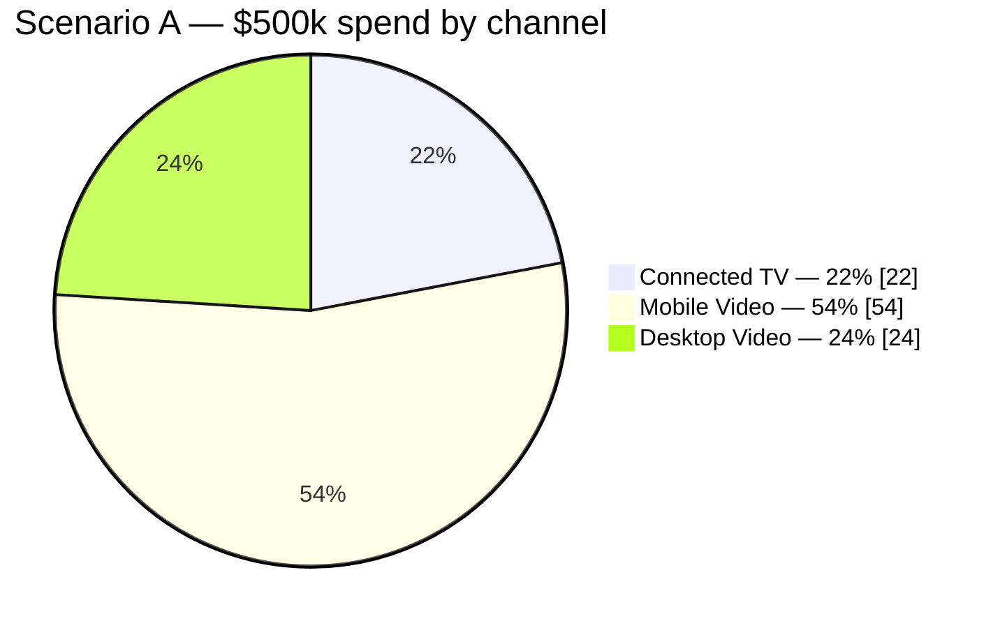
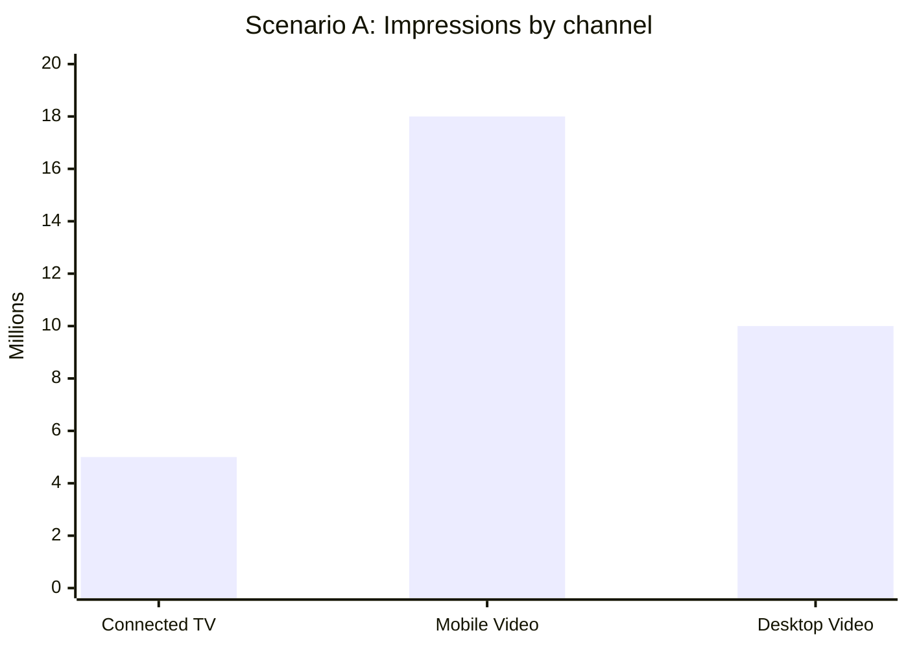
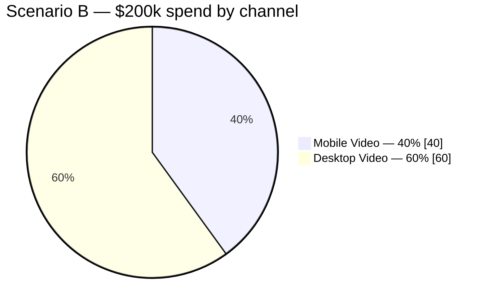
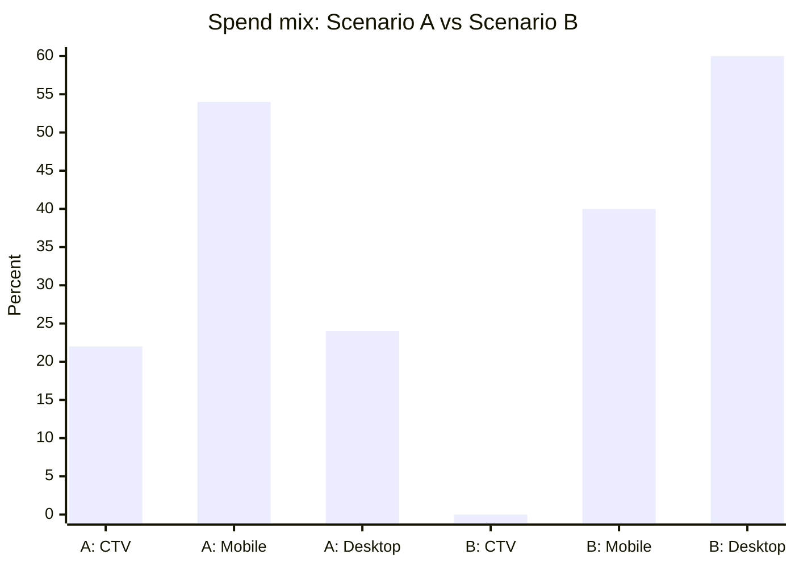
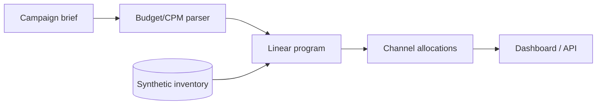

# AdPlan AI — Results, Charts & Technical Interpretation

> **Prototype v0.1.** The calculations below use the fixed synthetic inventory in [adplan/core.py](../adplan/core.py). They are **illustrative deterministic optimization outputs**, not real Netflix inventory, campaign forecasts, observed audience reach or online experiment results.

## 1. Executive overview

The application translates a basic dollar-budget and CPM brief into a channel-level allocation using linear optimization. It supports a local Streamlit UI and a FastAPI endpoint.

| Scenario | Budget | Allocated | Unspent | Blended CPM | Reach proxy |
|---|---:|---:|---:|---:|---:|
| A: $500k, CPM <= $25 | $500,000 | $500,000 | $0 | $15.15 | 19,040,000 |
| B: $200k, CPM <= $18 | $200,000 | $200,000 | $0 | $13.04 | ~7,893,333 |

**Interpretation:** Under these *fixed synthetic assumptions*, the optimizer allocates all budget while meeting the two specified blended CPM ceilings. The reach proxy is an additive score and must **not** be interpreted as unique viewers.

## 2. Synthetic inventory assumptions

| Channel | CPM | Available impressions | Reach factor |
|---|---:|---:|---:|
| Connected TV | $22 | 12,000,000 | 0.76 |
| Mobile Video | $15 | 18,000,000 | 0.58 |
| Desktop Video | $12 | 10,000,000 | 0.48 |

The optimizer maximizes `sum(impressions × reach factor)`, subject to budget, inventory capacity and blended CPM limits. It does not model overlap, frequency, uncertainty, conversion, or ad auction dynamics.

## 3. Scenario A — Electric SUV launch

**Advertiser brief:** "We have $500,000 for an electric SUV campaign. Keep CPM below $25 and maximize reach."

| Channel | Spend | Impressions | CPM | Synthetic reach proxy | Share of budget |
|---|---:|---:|---:|---:|---:|
| Connected TV | $110,000 | 5,000,000 | $22 | 3,800,000 | 22% |
| Mobile Video | $270,000 | 18,000,000 | $15 | 10,440,000 | 54% |
| Desktop Video | $120,000 | 10,000,000 | $12 | 4,800,000 | 24% |
| **Total** | **$500,000** | **33,000,000** | **$15.15 blended** | **19,040,000** | **100%** |

### Chart A1 — Budget share



### Chart A2 — Allocated impressions (millions)



### Interpretation

- Mobile Video gets the largest allocation because its synthetic objective return per dollar is better than Connected TV's and its inventory capacity is 18 million impressions.
- Desktop Video is filled to its 10 million-impression cap, followed by Mobile Video at its 18 million cap. Remaining budget goes to Connected TV.
- **Blended CPM $15.15** is below the $25 ceiling. This does not mean every channel costs less than $15.15.
- No audience overlap is deducted; **19.04 million is an optimization proxy, not a real reach estimate**.

## 4. Scenario B — Tighter budget and CPM ceiling

**Advertiser brief:** "We have $200k. CPM below $18."

| Channel | Spend | Impressions (approx.) | CPM | Synthetic reach proxy (approx.) | Share |
|---|---:|---:|---:|---:|---:|
| Connected TV | $0 | 0 | $22 | 0 | 0% |
| Mobile Video | $80,000 | 5,333,333 | $15 | 3,093,333 | 40% |
| Desktop Video | $120,000 | 10,000,000 | $12 | 4,800,000 | 60% |
| **Total** | **$200,000** | **15,333,333** | **$13.04 blended** | **~7,893,333** | **100%** |

### Chart B1 — Budget share



### Chart B2 — Comparison of budget distribution (%)



### Interpretation

Under these assumptions, the optimizer uses all Desktop Video capacity and spends the remaining budget on Mobile Video. Connected TV is not chosen because the cheaper channels yield a higher synthetic objective per dollar at this budget level. The $18 ceiling is satisfied by the blended $13.04 CPM.

**Important:** Scenario A and B have different budgets. Their total reach proxies are not an apples-to-apples measure of algorithmic improvement.

## 5. Constraint and quality checks

| Check | Scenario A | Scenario B |
|---|---|---|
| Spend <= budget | Satisfied | Satisfied |
| Spend nonnegative | Satisfied | Satisfied |
| Channel inventory caps | Satisfied | Satisfied |
| Blended CPM ceiling | $15.15 <= $25 | $13.04 <= $18 |
| Real-world predictive validity | Not established | Not established |
| Online business impact | Not measured | Not measured |

The current test source is [tests/test_core.py](../tests/test_core.py). Reproduce locally with:

```bash
pip install -r requirements.txt
python -m pytest -q
python - <<'PY'
from adplan.core import parse_brief, optimize
for text in [
    "We have $500,000 for an electric SUV campaign. Keep CPM below $25 and maximize reach.",
    "We have $200k. CPM below $18."
]:
    print(optimize(parse_brief(text)))
PY
```

## 6. Architecture and flow



See the [complete system architecture](../docs/ARCHITECTURE.md) for component responsibilities, optimization equations, interface contracts and a separately marked **future agentic architecture**.

## 7. Limitations and scientific integrity

1. All numbers are synthetic and should not be described as actual advertiser performance.
2. The objective is a linear **reach proxy**; it is not deduplicated reach or a validated predictive ML output.
3. No trained ML model, LLM agent, agent evaluation framework or seller feedback loop is implemented.
4. The current parser is regex-based and supports limited brief formats.
5. Inventory is static and contains only three channels.
6. Optimization variables are continuous; reported impressions are rounded.
7. The current repository is source code; deployment and real-world monitoring are not yet configured.

## 8. Next results to add

- Equal-split and cheapest-CPM baseline comparisons with objective deltas
- Sensitivity curves over budget, inventory and CPM constraints
- Parser accuracy across a labeled benchmark of varied advertiser briefs
- Forecast model evaluation with a held-out synthetic test set
- Agent tool-call validity and constraint-adherence evaluation
- API latency, failure-rate and reproducibility measurements

**Related:** [Architecture](../docs/ARCHITECTURE.md) · [Evaluation plan](../docs/EVALUATION.md) · [Project README](../README.md).
